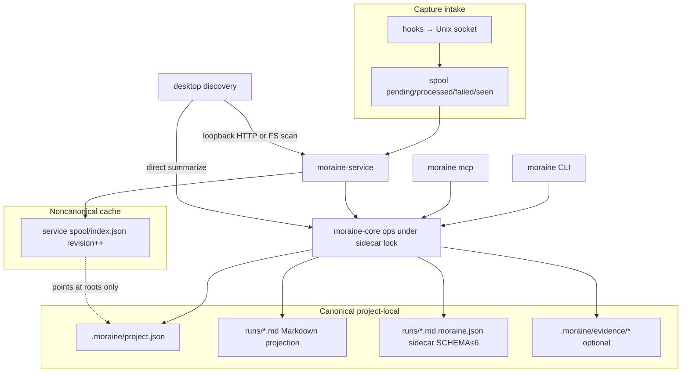

# Persistence and authority

## Authority rules

1. **Run ledger truth** = project sidecar (+ MD projection).
2. **Index** may be deleted; rebuild from disk.
3. **Browsing** must not mutate bundles (asserted by tests).
4. **Filesystem owner** can still edit files externally — not prevented.
