# Near-1.0 user workflow (target after consolidation)

```mermaid
flowchart LR
  A[Install Moraine pack] --> B[Start user service]
  B --> C[Init project in repo]
  C --> D[Configure one agent]
  D --> E[Do ordinary coding task]
  E --> F[Run appears in desktop without path]
  F --> G[Inspect timeline / evidence]
  G --> H[Add finding or observation]
  H --> I[Agent responds via MCP]
  I --> J[Reopen weeks later]
  J --> K[Still understandable without chat]
```

## Beta subset (smallest)

Same flow, **Linux + Codex only**, with documented limitations and sealed redaction.

## Explicitly out of 1.0-critical path

- Multiplayer Yjs rooms
- Second agent (until C1–C3 done; then optional)
- Hosted sync / teams
- Full-text semantic search
